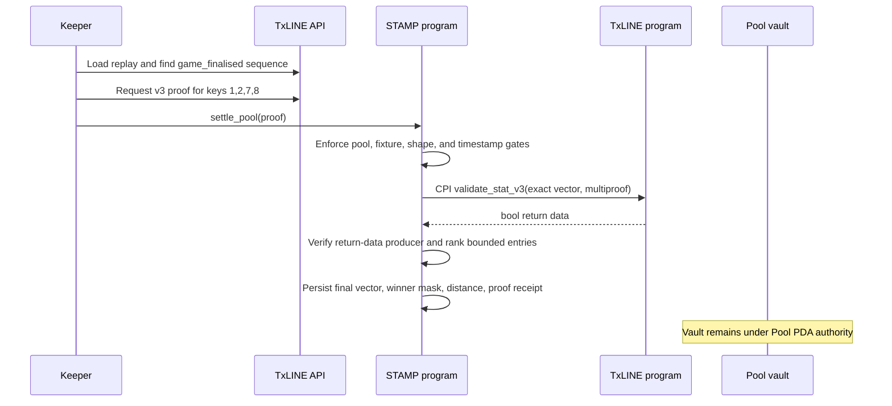

# STAMP Backend Architecture

## Trust boundaries

| Component | Can do | Cannot do |
| --- | --- | --- |
| Wallet | create/enter pools, lock, claim, refund | alter another wallet's position |
| STAMP program | hold vault authority, authenticate proof, rank, pay | fetch web APIs or choose discretionary winners |
| TxLINE program | authenticate committed match-stat leaves | move STAMP vault funds |
| Keeper | read replay/API, fetch proof, pay settlement fee | modify pool rules, forge final vector, redirect payout |
| Browser UI | build wallet transactions, read public state | receive TxLINE credentials or sign as keeper |

## Settlement sequence

## On-chain storage

The Pool stores a fixed array of 16 compact forecast records. Fixed capacity makes the
settlement loop bounded and auditable and avoids passing attacker-sized remaining-account
lists. Each wallet also receives its own Position PDA for claim/refund authorization.

Winner membership is a `u16` bit mask keyed by entry index. This makes claim checks constant
time and keeps payout state independent of entry ordering after settlement.

## Invariants

- `entry_count <= max_entries <= 16`
- `settle_after - cutoff_at >= 4 hours` in production
- one Position PDA per `(pool, wallet)`
- vault authority is always the Pool PDA
- prize total equals `entry_fee × entry_count`
- only the verified vector can reach ranking code
- only `OPEN` or `LOCKED` can become `SETTLED`/`REFUNDABLE`
- every Position can be paid at most once
- sum of winning claims equals the recorded prize total
- refunds are exactly one entry fee per unpaid Position

## Server packages

`packages/txline` is the reusable data seam adapted from the working Ticker/shared approach:

- API-token header and guest JWT refresh on `401`
- REST fixture/snapshot/replay calls
- incremental SSE parser with Last-Event-ID reconnect and capped backoff
- PascalCase score-event normalization
- final-sequence discovery from `game_finalised`
- strict Zod validation for the current v3 proof response
- Anchor argument conversion and daily-root PDA derivation

`services/api` exposes the future UI's read surface without exposing TxLINE credentials:
sanitized fixtures, normalized live SSE, public Pool state, deterministic settlement receipts,
and RPC/program health. It has no write routes and uses a generated read-only wallet.

`services/keeper` converts finalized fixtures into `settle_pool`. Its daemon can watch an
explicit allowlist or discover Pool accounts, skips terminal/early pools, classifies matches
without `game_finalised` as pending, and marks underfilled/timed-out pools refundable. A
compromised keeper key loses only its fee balance; it cannot withdraw the pool.

`services/wallet` owns claim construction. The finalization CLI may orchestrate settlement
and multiple local claims in one operator command, but it still submits one independently
signed `claim_prize` transaction per winning wallet. On-chain Position seeds, winner-mask
membership, and token-account ownership remain the payout authority.
